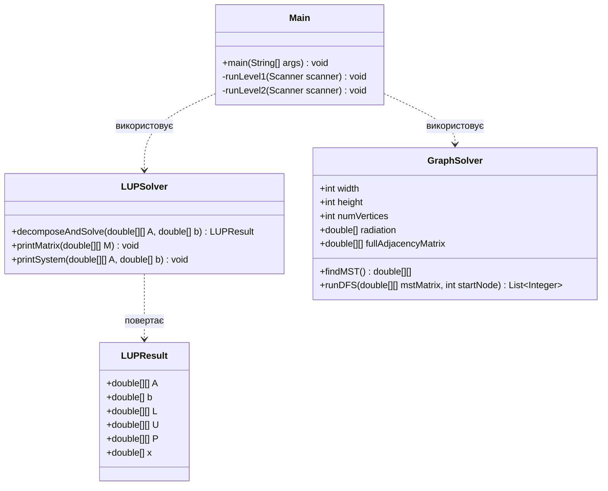

# Домашня робота
**Тема**: «Обчислювальні алгоритми та алгоритми обробки графів»

## Мета роботи
- Дослідження методів та алгоритмів для вирішення систем лінійних алгебраїчних рівнянь (СЛАР);
- Дослідження способів представлення такої структури даних як «Граф», алгоритмів її обробки та набуття практичних навичок із розв’язання задач на графах.

---

## Завдання (Варіант 4)

### Рівень 1
Розв'язати методом LUP-розкладання СЛАР:
$$\begin{cases} 
2x_1 - 9x_2 - 3x_3 - 6x_4 = -22 \\ 
3x_1 - 5x_2 + 4x_3 + x_4 = 6 \\ 
x_2 + 4x_3 - 3x_4 = 62 \\ 
6x_1 - 3x_2 + 9x_3 + 6x_4 = 30 
\end{cases}$$

### Рівень 2 (Графи)
Побудувати граф для карти радіоактивного зараження місцевості (сітка $W \times H$). З'єднати вершини графа так, щоб отримана загальна доза радіації була мінімальною (пошук мінімального кістякового дерева — MST). Представити граф у вигляді матриці суміжності та виконати обхід у глибину (DFS).

---

## Теоретичний опис алгоритмів

### 1. Метод LUP-розкладання
LUP-розкладання представляє матрицю коефіцієнтів $A$ у вигляді добутку $PA = LU$, де:
* $L$ — нижня трикутна матриця з одиницями на головній діагоналі;
* $U$ — верхня трикутна матриця;
* $P$ — матриця перестановки (дозволяє уникнути ділення на нуль або малі значення шляхом вибору головного елемента по стовпцю).

Після знаходження розкладу розв'язання системи $Ax = b$ зводиться до двох кроків:
1. Пряма підстановка (Forward Substitution): $Ly = Pb$ (знаходження допоміжного вектора $y$).
2. Зворотна підстановка (Back Substitution): $Ux = y$ (знаходження остаточного вектора $x$).

### 2. Алгоритм Пріма для пошуку MST
Для мінімізації сумарної радіації при зв'язуванні клітин сітки будується мінімальне кістякове дерево (MST). Вага ребра між сусідніми вершинами $u$ та $v$ дорівнює сумі їх рівнів зараження ($R_u + R_v$). Алгоритм Пріма працює наступним чином:
1. Ініціалізується дерево з однієї довільної вершини.
2. На кожному кроці додається ребро мінімальної ваги, що з'єднує вершину з дерева з вершиною поза деревом.
3. Процес повторюється, поки всі вершини не будуть включені в MST.

---

## Діаграма класів проєкту

