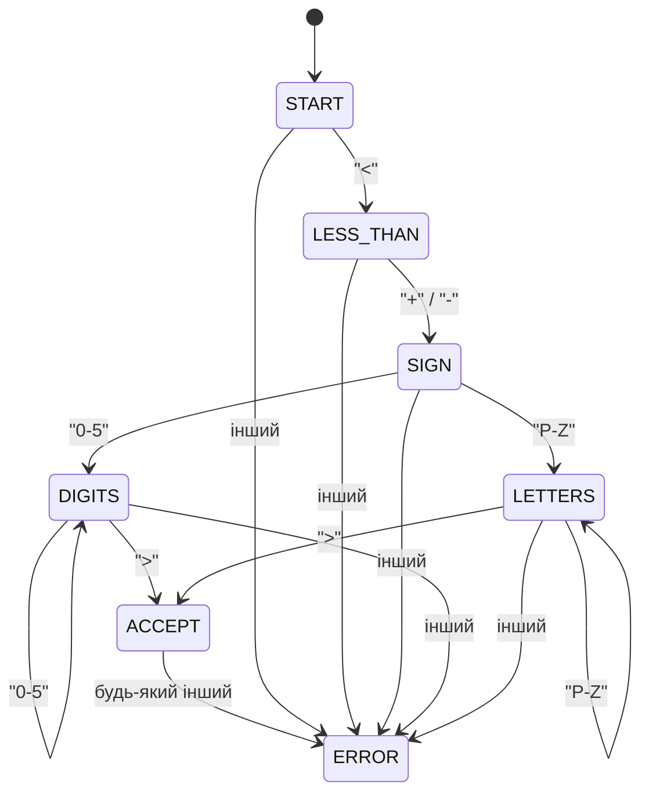

# Лабораторна робота 2.2

## Мета
Дослідити методи і способи розпізнавання текстових образів та набути практичних навичок використання регулярних виразів для пошуку текстових образів і скінченних автоматів для їх розпізнавання.

## Завдання (Варіант 4)
- **Рівень 1**: Створити текстовий файл `words.txt`, у якому кожен рядок містить одне слово. Описати регулярний вираз для пошуку слів, синтаксичну будову яких задано варіантом (початок з `<`, потім `+` або `-`, далі послідовність `0-5` або `P-Z`, кінець `>`). Знайти в файлі слова, які відповідають регулярному виразу.
- **Рівень 2**: Побудувати у вигляді графу скінченний автомат, який розпізнає текстовий образ, заданий регулярним виразом. Описати синтаксичний аналізатор на основі скінченного автомата, реалізованого за допомогою оператора `switch`.
- **Рівень 3**: Створити текстовий файл `text.txt`, у якому слова розділяються дужками `(` та `)`. Побудувати у вигляді таблиці переходів скінченний автомат. Реалізувати його в коді за допомогою таблиці переходів та циклу `for`. Прочитати з файлу текст, поділити його на слова за допомогою регулярного виразу та визначити правильність слів.

---

## Скінченний автомат (Варіант 4)

### Граф переходів автомата

### Таблиця переходів

| Стан / Символ | `<` | `+` / `-` | `0` - `5` | `P` - `Z` | `>` | Інші |
| :--- | :---: | :---: | :---: | :---: | :---: | :---: |
| **START** | LESS_THAN | ERROR | ERROR | ERROR | ERROR | ERROR |
| **LESS_THAN**| ERROR | SIGN | ERROR | ERROR | ERROR | ERROR |
| **SIGN** | ERROR | ERROR | DIGITS | LETTERS | ERROR | ERROR |
| **DIGITS** | ERROR | ERROR | DIGITS | ERROR | ACCEPT | ERROR |
| **LETTERS** | ERROR | ERROR | ERROR | LETTERS | ACCEPT | ERROR |
| **ACCEPT** | ERROR | ERROR | ERROR | ERROR | ERROR | ERROR |
| **ERROR** | ERROR | ERROR | ERROR | ERROR | ERROR | ERROR |

---

## Відповіді на контрольні запитання

**1. Що таке регулярний вираз? Для реалізації яких завдань застосовуються регулярні вирази?**
Регулярний вираз — це формальна мова опису текстових шаблонів за допомогою спеціальних символів і правил. Регулярні вирази застосовуються для валідації текстових полів (пошта, паролі, номери телефонів), пошуку закономірностей у текстах, заміни підрядків, парсингу логів та лексичного аналізу.

**2. За якими правилами формуються регулярні вирази?**
Регулярні вирази формуються за допомогою:
- звичайних символів (букви, цифри, що збігаються самі з собою);
- символьних класів (`[a-z]`, `\d`, `\s`);
- квантифікаторів для кількості (`*` від 0, `+` від 1, `?` від 0 до 1, `{n,m}`);
- логічного АБО (`|`);
- якорів меж рядка (`^`, `$`);
- групування за допомогою круглих дужок `()`.

**3. Як організована робота з регулярними виразами в мові програмування Java?**
В Java робота з регулярними виразами організована через пакет `java.util.regex`, який надає три основні класи:
- `Pattern` — скомпільований регулярний вираз;
- `Matcher` — двигун пошуку та зіставлення шаблону в тексті;
- `PatternSyntaxException` — виняток при синтаксичній помилці в регулярному виразі. Також деякі операції підтримуються методом `String.matches()`, `String.split()`, `String.replaceAll()`.

**4. Що таке скінченний автомат? Де його застосовують?**
Скінченний автомат — це абстрактна математична модель системи, яка має скінченну кількість внутрішніх станів та переходів між ними під впливом вхідних сигналів. Їх застосовують у лексичних аналізаторах компіляторів, розпізнаванні текстів, протоколах мережевої взаємодії, ігровому ШІ та цифрових електронних схемах.

**5. Якими способами можна подати скінченний автомат?**
Способи представлення скінченного автомата:
- **Граф переходів** (вузли — стани, напрямлені дуги — переходи з мітками символів);
- **Таблиця переходів** (рядки — стани, стовпці — вхідні символи/класи, комірки — наступний стан);
- **Матриця переходів** (опис зв'язків між станами);
- **Формальний математичний опис** у вигляді кортежу 5 елементів $(Q, \Sigma, \delta, q_0, F)$.

**6. Як застосовується скінченний автомат для регулярної мови?**
Скінченний автомат використовується для розпізнавання слів регулярної мови. Автомат зчитує символи вхідного рядка один за одним і переходить з одного стану в інший. Якщо після зчитування всього слова автомат перебуває в одному з приймальних (кінцевих) станів, слово вважається належним до мови, інакше — ні.

**7. Якими способами можна реалізувати скінченний автомат?**
Способи реалізації скінченного автомата в коді:
- **Оператор `switch-case`** у циклі (де стан змінюється через змінну перелічуваного типу);
- **Табличний метод** (використання двовимірних масивів або асоціативних карт `Map`, що описують таблицю переходів);
- **Шаблон проектування Стан (State Pattern)** (ООП-підхід, де кожен стан є окремим класом зі своєю логікою поведінки).

**8. Як можна класифікувати автомат?**
Автомати класифікують за:
- **Детермінованістю**: детерміновані (ДКА) та недетерміновані (НКА);
- **Наявністю вихідних сигналів**: автомати-розпізнавачі (без виходу) та автомати-перетворювачі (з виходом, наприклад, автомат Мілі та автомат Мура);
- **Скінченністю станів**: скінченні та нескінченні (автомати з пам'яттю, магазинні автомати).
